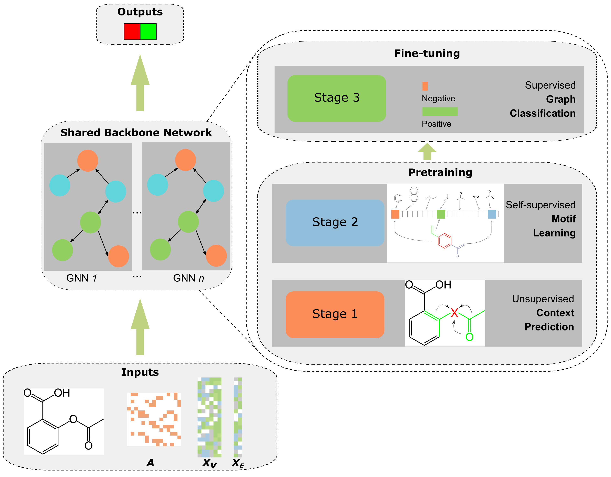

# COVID-19 Multi-Targeted Drug Repurposing Using Few-Shot 

This is a Pytorch implementation of the following paper:

Yang Liu, You Wu, Xiaoke Shen, Lei Xie. COVID-19 Multi-Targeted Drug Repurposing Using Few-Shot 


## Architecture 



## Installation 

The following packages are used.

``` 
pytorch           1.5.0
rdkit             2020.09.4
tensorboardx      2.1  
torch-cluster     1.5.7       
torch-geometric   1.6.1       
torch-scatter     2.0.5         
torch-sparse      0.6.7        
torch-spline-conv 1.2.0         
torchvision       0.6.0       
tqdm              4.48.2    
```


## Dataset download 

All the data files can be downloaded from here  [dataset_MolGNN](https://drive.google.com/file/d/1t0UyLxy2FEie3mhYdVCjEUX5-Bg5-_xn/view?usp=sharing)

It contains **Zinc standard agent** for contextPred node and edge pretraining, **Chembl** for fingerprint pretraining,, and  **jak1/2/3, mpro, ellinger, amu** for covid-19 drug repurposing fintuning. 

To use it, pleases unzip, and replace "dataset" argument with the saved location accordingly. 


## Training flow 

1. **Context prediction pretraining** 

   ```
   pretrain_contextpred.py --output_model_file OUTPUT_MODEL_PATH_CONTEXT
   ```

   This is the step1 in bash directory. It saves the result to *OUTPUT_MODEL_PATH_CONTEXT* to be further pretrained in step2. 

2. **Motif learning pretraining** 

   ```
   pretrain_fingerprint.py  --input_model_file OUTPUT_MODEL_PATH_CONTEXT \
   --output_model_file OUTPUT_MODEL_PATH_CONTEXT
   ```

   This is the step2 in bash directory. It is passed with the pretrained model from step1, then does Motif learning pretraining, and saves the reult to *OUTPUT_MODEL_PATH_CONTEXT* 

3. **Finetuning** 

   ```
   finetune.py --input_model_file OUTPUT_MODEL_PATH_MOTIF 
   ```

   This is the step3 in bash directory. It will fine-tune the pretrained model according to downstream task. 

## Reproducing results in the paper 

Saved Trained model can be found in *trained_model*. To reproduce our result run

```
bash/step3_finetune_ours.sh
```


